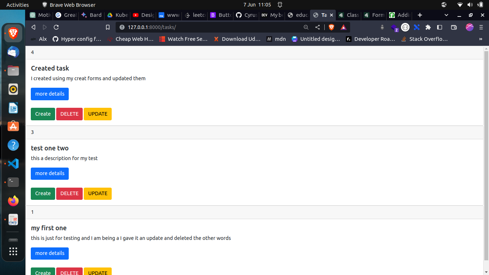
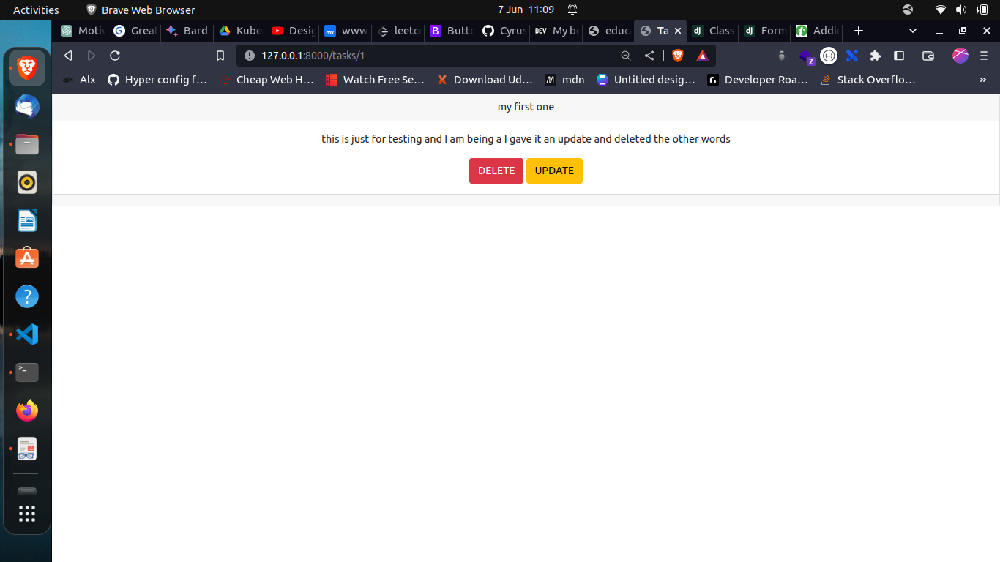

# django_crud

## Description
This is repo for a simple task management django project
Main aim to learn CRUD functionalities using Django Function based views

## Installation
```
git clone https://github.com/CyrusNchege/django_crud
```

```
cd django_crud
```

### Create a virtual environment  and acticate environment

#### linux
```
 python3 -m venv env

source env/bin/activate
```
#### windows
```
 python -m venv env

.\env\Scripts\activate

```
#### Install requirement 
```
pip install -r requirements.txt
```
make migrations
```
python manage.py makemigrations
python manage.py migrate
```
 Runserver
```
python manage.py runserver
```
#### Front View
##### Endpoint
/tasks/ 

http://127.0.0.1:8000/tasks/


#### Detail view

##### Endpoint

/tasks/ id/
http://127.0.0.1:8000/tasks/1/

Detail is a view that displays a single instance of a model.
